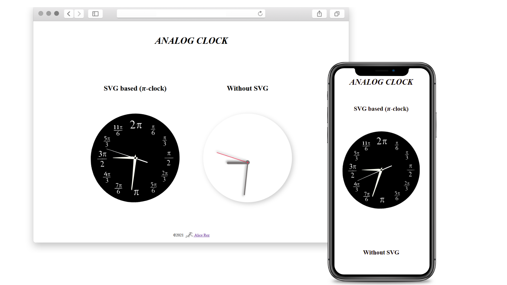

# Analog Clock

Explore [Live demo](https://alice-rez.github.io/analog-clock/)

Simple analog clock created using HTML, CSS and Vanilla JS. Two different designs:

1. basic without marks and numbers - created using only CSS
2. advanced with marks - created using SVG

The SVG-based design (𝜋-clock) functions also as a helper for conversion between radians and degrees (the position of the hand is showing angle between it and y-axis in radians 😊).

Function used for displaying time is universal for both clocks, difference is just in the given parameters.

**Used technologies:** Vanilla JS, DOM, DOM Manipulation, CSS, SVG, HTML

